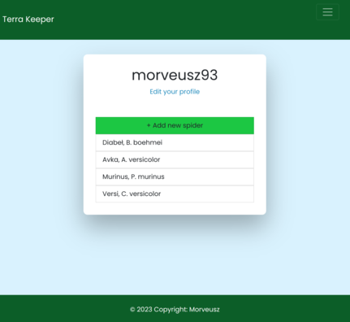
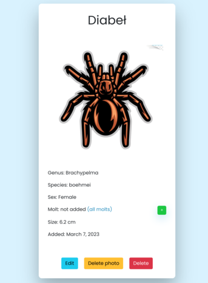
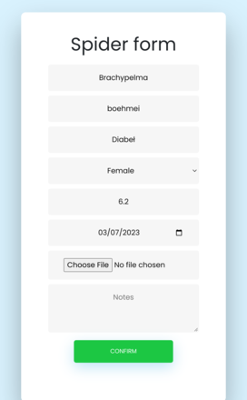
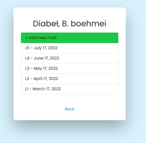

# Welcome to Terra Keeper!

## General info

### What is Terra Keeper?

Terra Keeper is a app for tarantulas keepers to organize infos about your pets. You can create an account and add your spiders to your list.

## ScreenShots

<br>
<br>
<br>
<br>
<br>

## Technologies

### Project is created with:

- Django
- Bootstrap
- SQLite3

## Setup

### To run this project:

- clone  repository
- type commands:
 ```
   poetry install
   python manage.py migrate
   python manage.py runserver
  ```